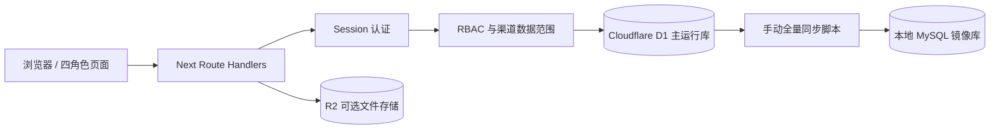
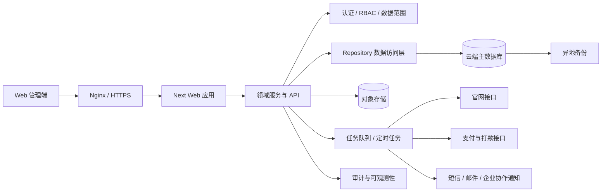

# 技术文档(开发文档)· 数影豹驱 AI 短剧教育 OA 管理系统

> 本文档为【项目技术层唯一文档】。只记录架构、代码、环境、部署、API、报错、配置、依赖、命令、密钥;不写业务规划。
> 更新规则:所有技术改动、报错、解决方案永久存档,只追加、不覆盖、不丢失;所有内容可复现、可部署、可排查。
> 最近更新:2026-08-06

---

## 1. 技术栈总览

### 2026-08-14 MySQL 数据镜像补充

- MySQL Server 9.7.1：本机独立数据镜像库，schema 为 `market_application`。
- `mysql2` 3.23.3：Node.js 侧建库、建表和批量导入驱动，仅用于数据同步脚本。
- Node.js `node:sqlite`：只读访问 Wrangler 本地 D1 SQLite 文件。
- 运行时主库仍为 Cloudflare D1；MySQL 当前定位为单向同步的数据镜像，不直接承接 Worker API 请求。

### 2026-08-14 后端模块 1—5 技术栈

- 运行框架：vinext 0.0.50、React 19.2.6、TypeScript 5.9.3、Cloudflare Worker。
- 数据库：Cloudflare D1（本地开发由 Wrangler/Miniflare 提供）。
- 数据访问：原生 D1 PreparedStatement；Drizzle ORM 0.45.2 负责 schema 与迁移生成。
- 认证安全：Web Crypto、PBKDF2-SHA256、随机会话令牌、SHA-256 会话令牌摘要。
- 二维码：qrcode 1.5.4，服务端生成 SVG。
- 工具链：@cloudflare/workers-types 4.20260702.1、cross-env 10.1.0。


| 层 | 技术 | 版本 |
|---|---|---|
| 运行时 | Node.js | ≥ 22.13.0(本机实测 v24.18.0,npm 11.16.0) |
| 前端框架 | Next.js(App Router) | 16.2.6 |
| UI 库 | React / React DOM | 19.2.6 |
| 构建/开发服务器 | Vite + vinext(Next-on-Vite 适配层) | Vite 8.0.13 / vinext 0.0.50 |
| RSC 支持 | @vitejs/plugin-rsc / react-server-dom-webpack | 0.5.26 / 19.2.6 |
| 样式 | Tailwind CSS(PostCSS 插件)+ 自定义全局 CSS | 4.2.1 |
| 边缘运行时 | Cloudflare Workers(经 @cloudflare/vite-plugin + wrangler 本地模拟) | plugin 1.37.1 / wrangler 4.92.0 |
| ORM | Drizzle ORM(D1/SQLite 方言) | 0.45.2(drizzle-kit 0.31.10) |
| 语言 | TypeScript(strict) | 5.9.3 |
| Lint | ESLint 9 + eslint-config-next | 9.39.4 / 16.2.6 |
| 包管理 | npm(package-lock.json) | — |

模块类型:`"type": "module"`(ESM)。

## 2. 整体架构设计(数据流 / 模块结构)

### 2026-08-14 D1 到 MySQL 同步数据流

```text
Cloudflare D1 本地文件（运行时数据源）
  -> scripts/mysql-import.mjs 只读提取
  -> 创建/校验 market_application schema
  -> MySQL 事务内清理九张镜像表
  -> 按表写入全部当前数据
  -> data_sync_runs 追加同步时间、来源和各表行数
```

同步覆盖 `roles`、`role_permissions`、`accounts`、`sessions`、`channels`、`end_users`、`invitations`、`invitation_bindings`、`audit_logs`。同步失败时事务整体回滚；`data_sync_runs` 历史只追加。

### 2026-08-14 后端数据流

```text
浏览器页面
  -> App Router API Route
    -> 会话认证 requireAccount
      -> 角色权限 requirePermission / 数据范围 accessibleChannelIds
        -> D1 PreparedStatement
          -> accounts / sessions / channels / end_users / invitations / invitation_bindings / audit_logs
```

模块边界：

1. `server/security.ts`：密码散列、密码校验、令牌生成、摘要计算。
2. `server/auth.ts`：登录、会话读取、会话 Cookie、退出。
3. `server/policy.ts`：权限校验、邀请目标限制、递归渠道数据范围。
4. `server/database.ts`：D1 绑定、表初始化、开发账号种子、审计日志。
5. `app/api/**/route.ts`：认证、权限、渠道、用户、邀请和公开登记接口。


### 2.1 请求数据流

```
浏览器
  → Vite dev server(vinext dev,端口 3001)
  → Cloudflare Worker 入口 worker/index.ts
      ├─ /_vinext/image → vinext 图片优化(env.IMAGES 变换 + env.ASSETS 取静态资源)
      └─ 其余请求 → vinext/server/app-router-entry(Next App Router 渲染)
          → app/layout.tsx(RootLayout,zh-CN,全局元数据)
          → app/page.tsx("use client" 单页应用)
```

### 2.2 前端模块结构(app/page.tsx,单文件组件树)

```
Home(根组件,useState 管理 view/role/toast/approvals)
├─ 侧边栏(nav 按 roleNav[role] 过滤)
├─ 顶栏(搜索占位 / 审批角标 / 角色切换 select)
├─ RoleDashboard(按角色分发)
│   ├─ Overview(超级管理员)
│   ├─ MarketDashboard(市场端 A)
│   ├─ FranchiseDashboard(加盟端 B)
│   └─ AgentDashboard(代理端 C)
├─ ChannelEcosystem / UserCenter / ProductPricing
├─ OrderManagement / Wallet
├─ ApprovalCenter(唯一有状态变更的模块:decide() 更新 approvals)
├─ Permissions
└─ 公共组件:PanelHead(面板标题)、DataTable(通用表格)
```

- 全部状态在客户端内存(useState),无持久化、无 API 请求。
- 演示数据以常量数组硬编码于 page.tsx 顶部(partners/users/products/orders/approvals 初始值)。
- 样式集中在 app/globals.css(约 30KB,类名如 oaShell/oaSidebar/oaPanel,角色主题类 role-A/B/C/员)。

### 2.3 数据库层(已搭好、未启用)

- db/index.ts:`getDb()` 通过 `cloudflare:workers` 的 `env.DB`(D1 绑定)创建 drizzle 实例;绑定缺失时抛错。
- db/schema.ts:**当前为空**(有意为之),需要时参照 examples/d1/db/schema.ts 添加表。
- .openai/hosting.json:`{ "d1": null, "r2": null }` → vite.config.ts 中 d1/r2 绑定均未注入,当前**无数据库运行**。
- 启用步骤:hosting.json 中 `"d1": "DB"` → 在 db/schema.ts 定义表 → `npm run db:generate` 生成迁移(输出至 drizzle/)。

### 2.4 认证层(已备好、未接线)

- app/chatgpt-auth.ts:ChatGPT 平台托管场景的认证工具,从请求头 `oai-authenticated-user-email` / `oai-authenticated-user-full-name`(percent-encoded-utf-8)读取用户;提供 `getChatGPTUser` / `requireChatGPTUser` / 登入登出路径构造(含 return_to 相对路径安全校验,防开放重定向)。当前页面未调用。

## 3. 本地开发环境配置

### 2026-08-14 MySQL 本地配置

1. 本机服务：MySQL 9.7，TCP `localhost:3306`。
2. 目标数据库：`market_application`，脚本首次运行时自动创建。
3. 从 `.env.example` 创建本地 `.env.local`，填写真实连接信息。
4. `.env.local` 已被仓库根目录和应用目录的 `.gitignore` 排除，不得提交。
5. 执行 `npm run db:mysql:import` 完成建表和全量同步。

本次同步验证结果：4 个角色、22 条角色权限、5 个管理账号、3 个会话、4 个渠道、4 个用户、4 条邀请、1 条邀请绑定、27 条审计日志、1 条同步记录。

### 2026-08-14 当前可复现环境

- Node.js：项目要求 `>=22.13.0`，本机验证版本为 24.18.0。
- 安装依赖：`npm install`。
- D1 绑定：`.openai/hosting.json` 中配置 `"d1": "DB"`。
- 开发启动：`npm run dev -- --port 3002`。
- 当前本地验证地址：`http://localhost:3002/`。

本地开发种子账号：

| 角色 | 用户名 | 手机号 | 初始密码 |
|---|---|---|---|
| 超级管理员 | `admin` | `13800000000` | `Admin@123456` |
| 市场端 | `market` | `13800000001` | `Market@123456` |
| 加盟端 | `franchise` | `13800000002` | `Franchise@123456` |
| 代理端 | `agent` | `13800000003` | `Agent@123456` |

以上账号仅用于本地开发，生产环境必须删除种子逻辑并更换全部密码。


### 3.1 前置要求

- Node.js ≥ 22.13.0
- 无需任何环境变量或密钥即可本地运行

### 3.2 安装与启动(Windows 实测流程)

```powershell
cd "AI短剧OA管理系统"
npm install

# 注意:不要直接 npm run dev(见报错库 E-001),Windows 下用:
$env:WRANGLER_LOG_PATH='.wrangler/wrangler.log'
.\node_modules\.bin\vinext.cmd dev --port 3001
```

macOS / Linux 直接:

```bash
npm run dev -- --port 3001
```

启动成功输出:

```
vinext dev  (Vite 8.0.13)
➜ Local:   http://localhost:3001/
➜ Debug:   http://localhost:3001/__debug
```

访问 http://localhost:3001/ ,首页返回 HTTP 200 即正常。

### 3.3 特殊环境说明

- vite.config.ts 会将 Wrangler/Miniflare 状态限制在项目内:`WRANGLER_WRITE_LOGS=false`、`WRANGLER_LOG_PATH=.wrangler/logs`、`MINIFLARE_REGISTRY_PATH=.wrangler/registry`(均有默认值,无需手动设置)。
- Codex Seatbelt 沙箱(macOS)下自动切换为轮询式 HMR(`CODEX_SANDBOX=seatbelt`)。

## 4. 服务器部署流程 & 开机自启

### 2026-08-14 模块 1—5 部署补充

1. 部署环境必须提供名为 `DB` 的 Cloudflare D1 binding。
2. 部署前执行 `npm ci`、`npm run typecheck`、`npm run lint`、`npm test`。
3. 首次正式部署应执行 `drizzle/0000_parched_scourge.sql`，不要依赖开发种子数据。
4. 正式环境应关闭或删除 `seedDevelopmentAccounts`，由初始化管理员流程创建首个超管。
5. 会话 Cookie 在 HTTPS 请求中自动追加 `Secure`，生产站点必须使用 HTTPS。


### 4.1 目标平台

项目按 Cloudflare Workers 形态构建(worker/index.ts 为入口,依赖 ASSETS/IMAGES/D1 绑定),生产部署面向 Cloudflare(wrangler deploy)或 OpenAI Site Creator 托管控制面(.openai/hosting.json 注入真实绑定)。

```bash
npm run build            # vinext build
npm run start            # 本地以生产模式预览
```

**当前尚未配置正式部署**(无 wrangler.toml,hosting.json 绑定为 null)。正式部署 Cloudflare 时需:创建 D1 数据库与 R2 桶 → 补充 wrangler 配置(name/main/compatibility_flags/bindings)→ `wrangler deploy`。

### 4.2 本机开机自启(Windows,可选)

如需本机常驻演示,可用任务计划程序:

```powershell
schtasks /Create /TN "AI短剧OA" /SC ONLOGON /TR "powershell -NoProfile -Command \"Set-Location 'C:\Users\xiao''xiong\Desktop\AI短剧教育OA管理系统-本地版\AI短剧OA管理系统'; `$env:WRANGLER_LOG_PATH='.wrangler/wrangler.log'; .\node_modules\.bin\vinext.cmd dev --port 3001\""
```

(演示原型阶段不建议常驻;正式环境应使用构建产物 + 进程守护。)

## 5. 完整项目目录说明

### 2026-08-14 MySQL 新增文件

- `db/mysql-schema.sql`：MySQL 九张业务镜像表及 `data_sync_runs` 同步记录表。
- `scripts/mysql-import.mjs`：定位最新本地 D1 文件、统一时间格式、事务同步并输出行数。
- `.env.example`：可提交的数据库变量占位模板。
- `.env.local`：本机真实数据库连接配置，已忽略且禁止提交。
- 仓库根 `.gitignore`：统一排除依赖、构建输出、Wrangler 状态、日志和本地密钥。

### 2026-08-14 新增目录与文件

```text
AI短剧OA管理系统/
├─ app/api/auth/                    # 登录、退出、当前会话
├─ app/api/permissions/             # 当前角色权限
├─ app/api/channels/                # 渠道列表、新增、详情、编辑
├─ app/api/users/                   # 用户列表、新增、详情、编辑
├─ app/api/invitations/             # 邀请列表、创建、撤销、二维码
├─ app/api/public/                  # 公开邀请查询与登记
├─ app/register/page.tsx            # 邀请登记页面
├─ server/auth.ts                   # 会话认证
├─ server/database.ts               # D1 初始化与种子
├─ server/http.ts                   # 请求校验与错误响应
├─ server/policy.ts                 # 权限与数据范围
├─ server/security.ts               # 密码和令牌安全
├─ server/types.ts                  # 后端角色类型
├─ db/schema.ts                     # 9 张表的 Drizzle schema
└─ drizzle/0000_parched_scourge.sql # 首版迁移
```


```
AI短剧教育OA管理系统-本地版/
├─ 项目文档.md / 技术文档.md      ← 本双文档体系
└─ AI短剧OA管理系统/              ← 项目根
   ├─ app/
   │  ├─ layout.tsx               根布局(元数据、zh-CN、favicon)
   │  ├─ page.tsx                 整个 OA 前端(约 28KB,全部页面组件与演示数据)
   │  ├─ globals.css              全局样式(约 30KB,含角色主题)
   │  └─ chatgpt-auth.ts          ChatGPT 托管认证工具(未接线)
   ├─ worker/index.ts             Cloudflare Worker 入口(图片优化 + App Router 转发)
   ├─ db/
   │  ├─ index.ts                 getDb():drizzle + D1 绑定
   │  └─ schema.ts                空 schema(按需添加表)
   ├─ drizzle/                    迁移输出目录(meta/_journal.json)
   ├─ examples/d1/                D1 + Drizzle 参考实现(notes 表 + API 路由)
   ├─ tests/rendered-html.test.mjs 构建产物 HTML 冒烟测试(node --test)
   ├─ public/                     静态资源(leopard-speed-logo.png、favicon.svg 等)
   ├─ build/sites-vite-plugin     Site Creator 定制 Vite 插件
   ├─ .openai/hosting.json        托管绑定声明(d1/r2,当前均 null)
   ├─ .vinext/                    vinext 运行时生成物
   ├─ .wrangler/                  wrangler/miniflare 本地状态与日志(git 忽略)
   ├─ vite.config.ts              Vite + vinext + cloudflare 插件配置
   ├─ drizzle.config.ts           drizzle-kit(sqlite 方言,schema→./drizzle)
   ├─ next.config.ts / tsconfig.json / eslint.config.mjs / postcss.config.mjs
   └─ package.json                脚本与依赖
```

## 6. 环境变量 & 密钥配置规范

### 2026-08-14 MySQL 环境变量

| 变量 | 必填 | 说明 |
|---|---|---|
| `MYSQL_HOST` | 是 | 数据库主机，本机为 `localhost` |
| `MYSQL_PORT` | 否 | 默认 `3306` |
| `MYSQL_USER` | 是 | 数据库账号 |
| `MYSQL_PASSWORD` | 是 | 数据库密码，只能保存在 `.env.local` 或安全密钥服务 |
| `MYSQL_DATABASE` | 否 | 默认 `market_application`，仅允许字母、数字和下划线 |
| `D1_SOURCE_FILE` | 否 | 指定本地 D1 文件；未配置时自动选择最新非 metadata SQLite 文件 |

提交前必须执行 `git status --ignored` 和密钥扫描，确认 `.env.local`、`.wrangler` 和数据库文件没有进入暂存区。文档、示例文件和提交信息均不得出现真实密码。

### 2026-08-14 配置补充

- 必需绑定：`DB`（Cloudflare D1Database）。
- 日志路径：`WRANGLER_LOG_PATH=.wrangler/wrangler.log`，由 `cross-env` 跨平台注入。
- 当前实现不保存明文密码；数据库只保存 PBKDF2 散列。
- 会话 Cookie 名称：`ls_session`，属性为 `HttpOnly; SameSite=Lax; Path=/; Max-Age=604800`，HTTPS 下增加 `Secure`。
- 当前模块没有第三方 API 密钥；后续接入 OpenAI、Claude、飞书时必须通过环境变量或平台密钥管理注入，禁止写入仓库。


- **当前项目无任何密钥**,本地运行零配置。
- 应用级环境变量应放入被 git 忽略的 `.env*` 文件(vite.config.ts 注释明确此约定);**严禁将密钥写入 vite.config.ts / hosting.json / 源码**。
- 工具级变量(非密钥,已有默认值):`WRANGLER_LOG_PATH`、`WRANGLER_WRITE_LOGS`、`MINIFLARE_REGISTRY_PATH`、`CODEX_SANDBOX`。
- Cloudflare 部署密钥(未来):使用 `wrangler secret put <NAME>`,不落盘。

## 7. 第三方 API 接入文档(OpenAI / Claude / 飞书等)

### 2026-08-14 当前状态

后端模块 1—5 未接入 OpenAI、Claude、飞书或外部短信服务。二维码由本地 `qrcode` 包生成，不调用外部二维码 API。后续手机号验证码上线前，需要新增短信供应商、频率限制、验证码有效期和失败审计。


- **当前未接入任何第三方 API**(无支付、无通知、无 LLM 调用)。
- 预留能力:
  - ChatGPT 托管登录:app/chatgpt-auth.ts 已实现请求头解析与安全跳转,托管在 OpenAI Site Creator 平台时可直接使用 `/signin-with-chatgpt`、`/signout-with-chatgpt`、`/callback` 三个保留路径。
  - Cloudflare Images:worker/index.ts 已接 `/_vinext/image` 图片优化端点(env.IMAGES)。
- 后续接入(支付/提现、飞书审批通知等)时在本节追加:端点、鉴权方式、请求/响应示例、错误码。

## 8. 核心模块技术实现说明

### 2026-08-14 模块 1—5 实现

**认证与账号**

- `POST /api/auth/login`：用户名或手机号 + 中文角色 + 密码登录。
- `GET /api/auth/me`：读取当前会话。
- `POST /api/auth/logout`：删除会话并清理 Cookie。
- 密码：PBKDF2-SHA256，120,000 次迭代，16 字节随机 salt。
- 会话：32 字节随机令牌，数据库只保存 SHA-256 摘要，有效期 7 天。

**角色与权限**

- `GET /api/permissions` 返回当前账号权限。
- 超管 8 项权限；市场端 7 项；加盟端 4 项；代理端 3 项。
- 渠道范围使用递归 CTE：超管全部，市场端自身及下级，加盟端自身及下级代理，代理端禁止读取渠道接口。

**渠道管理**

- `GET/POST /api/channels`。
- `GET/PATCH /api/channels/[id]`。
- 新建渠道同时创建对应登录账号；编辑渠道可更新账号、手机号、状态和可选的新密码。
- 返回结构不包含 `parent_channel_id`，避免向业务界面暴露完整层级链路。

**用户管理**

- `GET/POST /api/users`。
- `GET/PATCH /api/users/[id]`。
- 新增用户默认绑定当前账号；绑定其他邀请账号时校验其是否处于当前账号数据范围内。
- 普通编辑接口不修改 `invited_by_account_id`，避免破坏永久绑定。

**邀请二维码**

- `GET/POST /api/invitations`。
- `PATCH /api/invitations/[id]`。
- `GET /api/invitations/[id]/qrcode` 返回 `image/svg+xml`。
- `GET /api/public/invitations/[code]` 查询公开邀请。
- `POST /api/public/register` 完成用户或管理角色登记，并写入 `invitation_bindings`。


1. **单页视图路由**:不使用 Next 多路由,`view: View`(8 个中文字面量联合类型)+ 条件渲染切换模块;`role: Role` 控制导航过滤(roleNav 映射)与首页分发(RoleDashboard)。
2. **审批状态机**:`Approval.status: "待审批" | "已通过" | "已驳回"`;`decide(id, status)` 用 map 生成新数组更新 state;`pending` 由 filter 派生,驱动侧边栏/顶栏角标。
3. **Toast**:`notify(msg)` 设置字符串 state,`window.setTimeout` 2200ms 后清空;单实例,后触发覆盖先触发。
4. **通用表格 DataTable**:`heads: string[]` + `rows: string[][]`,行为 button(整行可点击),末列自动加 `statusCell` 类做状态着色。
5. **角色主题**:根元素类 `role-${role.slice(-1)}`(取角色名最后一个字符,如 "市场端 A" → role-A),globals.css 按该类切换主题色。
6. **图表**:纯 CSS/内联样式实现(柱状图为定高 div,漏斗为递减宽度,进度用 `<progress>`),无图表库依赖。
7. **图片**:next/image + Worker 端 `/_vinext/image` 优化管道;SVG 默认直接服务不走优化器。
8. **测试**:`npm test` = 先 build 再对构建产物 HTML 做 node:test 冒烟断言(tests/rendered-html.test.mjs)。

## 9. 所有报错汇总库(现象 + 根因 + 解决方案)

### E-011｜github.com:443 直连超时

- **现象**：`git ls-remote` 和标准 `git push` 无法连接 `github.com:443`，等待约 21 秒后超时。
- **根因**：当前本机网络对 GitHub Web 域名直连受限；DNS、MySQL 和本地项目均正常，SSH 22 端口可达但未配置 GitHub SSH 公钥。
- **最终解决方案**：使用 GitHub 官方 `api.github.com` 的 Git Data API，在已授权的本机 Git Credential Manager 会话中创建 blob、tree、commit 并更新 `main` 引用；凭据只在进程内使用，不写入仓库。
- **状态**：本次已解决；后续常规推送仍优先使用标准 `git push`，若网络限制持续存在则复用官方 API 归档流程。

### E-010｜MySQL 拒绝 D1 ISO 8601 时间

- **现象**：同步 `sessions.expires_at` 时返回 `Incorrect datetime value`。
- **根因**：D1 内同时存在 `YYYY-MM-DD HH:mm:ss` 和带 `T`、毫秒、`Z` 的 ISO 8601 字符串，MySQL `DATETIME` 严格模式不直接接受后者。
- **最终解决方案**：同步脚本识别所有 `_at` 字段，将有效 ISO 8601 字符串统一转换为 UTC `YYYY-MM-DD HH:mm:ss` 后写入；首次失败事务已完整回滚，修复后重新同步成功。
- **状态**：已解决。

### E-006｜Windows 无法执行 npm 构建脚本

- **现象**：`npm run build` 报 `'WRANGLER_LOG_PATH' is not recognized`。
- **根因**：原脚本使用 Unix 环境变量前缀语法。
- **解决方案**：安装 `cross-env`，统一修改 `dev/build/start` 脚本。
- **状态**：已解决，Windows 上 `npm run build` 验证通过。

### E-007｜本地 D1 初始化报 incomplete input

- **现象**：登录接口返回 500；日志为 `D1_EXEC_ERROR ... PRAGMA foreign_keys = ON;: incomplete input`。
- **根因**：本地 D1 `exec()` 对多行 SQL 的解析方式与当前建表脚本不兼容。
- **解决方案**：将建表语句拆分为单条 PreparedStatement，逐条执行；正式部署继续使用 Drizzle migration。
- **状态**：已解决，账号种子和 9 张表初始化成功。

### E-008｜PowerShell 测试中文角色返回 400

- **现象**：通过 PowerShell 直接提交中文角色时返回“请选择有效角色”。
- **根因**：请求正文未按 UTF-8 字节发送，中文值在管道中被破坏。
- **解决方案**：指定 `application/json; charset=utf-8` 并传入 UTF-8 bytes，或使用浏览器/Node fetch。
- **状态**：服务端无缺陷，UTF-8 请求登录成功。


### E-001|Windows 下 `npm run dev` 无法启动

- **现象**:`npm run dev` 报错/无输出,dev 脚本不执行。
- **根因**:package.json 脚本 `"dev": "WRANGLER_LOG_PATH=.wrangler/wrangler.log vinext dev"` 使用 Unix 风格的"内联环境变量前缀",Windows cmd/PowerShell 不支持该语法。
- **解决方案**(任选其一):
  ```powershell
  # 方案 A(实测采用):先设环境变量再直接调用本地二进制
  $env:WRANGLER_LOG_PATH='.wrangler/wrangler.log'
  .\node_modules\.bin\vinext.cmd dev --port 3001
  ```
  方案 B:安装 cross-env 并把脚本改为 `cross-env WRANGLER_LOG_PATH=... vinext dev`(跨平台一劳永逸)。
- **状态**:已解决(2026-08,方案 A)。

### E-002|npx 拉取了错误版本的 vinext

- **现象**:在**项目目录之外**执行 `npx vinext dev` 时输出 `npm warn exec The following package was not found and will be installed: vinext@1.0.0-beta.4`,随后启动挂起/行为异常。
- **根因**:工作目录不在项目根,npx 找不到本地 node_modules 中的 vinext@0.0.50,转而从 registry 安装最新版(1.0.0-beta.4,与项目不兼容)。
- **解决方案**:务必先 `cd` 到 `AI短剧OA管理系统` 目录,并直接调用 `.\node_modules\.bin\vinext.cmd`,不要裸用 npx。
- **状态**:已解决(2026-08)。

### E-003|后台启动的 dev server 随会话退出而停止

- **现象**:通过 Claude Code 后台任务启动的 dev server,在会话结束后端口 3001 无法访问。
- **根因**:后台任务是会话子进程,会话(或其宿主进程)退出时被终止。
- **解决方案**:需要常驻时,自行开独立终端运行启动命令,或按 §4.2 配置任务计划;会话内演示则每次重新启动即可。
- **状态**:已知行为,按需处理。

### E-004|db/index.ts 抛 "Cloudflare D1 binding `DB` is unavailable"

- **现象**:调用 getDb() 时抛该错误。
- **根因**:.openai/hosting.json 中 `"d1": null`,vite.config.ts 未注入 D1 绑定。
- **解决方案**:将 hosting.json 改为 `{"d1": "DB", ...}` 后重启 dev server;当前原型不使用数据库,属预期防御。
- **状态**:预期行为(当前未触发,前端未调用 getDb)。

### E-009｜模板测试引用已删除的 SkeletonPreview

- **现象**：`npm test` 在生产构建成功后仍失败，报 `cloudflare:` URL scheme 不受 Node ESM loader 支持，并提示 `app/_sites-preview/SkeletonPreview.tsx` 不存在。
- **根因**：测试文件仍为 starter 模板的加载骨架测试，与当前 OA 项目和 Cloudflare Worker 运行方式无关。
- **解决方案**：重写 `tests/rendered-html.test.mjs`，改为静态验证 13 条路由、9 张表、安全参数、前端接口接入和双文档归档。
- **状态**：已解决，4 项测试全部通过。
## 10. 常用开发命令手册

### 2026-08-14 MySQL 同步命令

```powershell
# 在 AI短剧OA管理系统 目录执行
Copy-Item .env.example .env.local
# 编辑 .env.local，填写本机真实连接信息
npm run db:mysql:import

# 使用 MySQL 客户端复核，密码通过安全方式输入，不写进命令历史
& "C:\Program Files\MySQL\MySQL Server 9.7\bin\mysql.exe" `
  --host=localhost --port=3306 --user=root --password `
  --database=market_application
```

`db:mysql:import` 是全量镜像同步：九张目标业务表会在事务内按当前 D1 数据重建内容，不应在 MySQL 镜像表中直接维护独立业务数据。

### 2026-08-14 新增命令

```powershell
npm install
npm run typecheck
npm run lint
npm run db:generate
npm run build
npm test
npm run dev -- --port 3002
```

核心运行验证结果：TypeScript 0 错误；ESLint 0 错误（8 条非阻断警告）；生产构建成功；13 条 API/页面路由完成打包；4 项项目回归测试全部通过；本地首页 HTTP 200。


```powershell
# —— 全部在项目根 AI短剧OA管理系统/ 下执行 ——

npm install                                  # 安装依赖

# 开发(Windows,实测)
$env:WRANGLER_LOG_PATH='.wrangler/wrangler.log'
.\node_modules\.bin\vinext.cmd dev --port 3001

npm run dev -- --port 3001                   # 开发(macOS/Linux)
npm run build                                # 生产构建(vinext build)
npm run start                                # 生产模式本地预览
npm test                                     # build + 构建产物 HTML 冒烟测试
npm run lint                                 # ESLint(忽略 dist/.next)
npm run db:generate                          # drizzle-kit generate(schema→迁移)

# 验证服务
Invoke-WebRequest http://localhost:3001/ -UseBasicParsing   # 期望 200
Start-Process "http://localhost:3001/"                       # 打开浏览器
```

## 11. 版本技术迭代记录

| 日期 | 变更 |
|---|---|
| —(原型交付) | 基于 site-creator-vinext-starter 模板搭建;完成 app/page.tsx 单页 OA 原型与 globals.css 全套样式;Worker/D1/认证脚手架保留未启用 |
| 2026-08-06 v1 | Windows 本地环境首次跑通:Node v24.18.0 + npm install + vinext.cmd 直启(端口 3001,HTTP 200);确认 npm run dev 脚本在 Windows 不可用(E-001)并固化替代启动命令;建立技术文档 |
| 2026-08-06 v2 | **架构重构**:page.tsx 重写为四端口分离架构。新增组件:PortalSelector(端口选择首屏)、CommissionRates(佣金比例调整)、InviteCenter(去链路邀请管理);状态提升:commRates/rateLog/payouts/approvals 全部提升至 Home 根组件统一管理;props 透传至子组件。新增 CSS 类:portalSelector/portalCard/scopeNote/payoutForm/rateTable/rateRow/inviteGrid/inviteCard。globals.css 新增约 60 行新模块样式(追加方式,不覆盖已有样式)。移除:角色预览条(rolePreviewBar)相关组件与交互逻辑 |

| 2026-08-14 v4 | 完成后端模块 1—5：D1 九表 schema/迁移、PBKDF2 登录与 7 天会话、角色权限与递归数据范围、渠道与用户 CRUD、邀请二维码/链接/撤销/公开登记/永久绑定、审计日志；前端接入真实接口；补充 cross-env 和 Cloudflare Worker 类型；完成 TypeScript、lint、build 与运行时冒烟测试。 |
| 2026-08-14 v4.1 | 新增 MySQL 9.7 数据镜像：mysql-schema.sql、mysql-import.mjs、本地密钥模板和 db:mysql:import 命令；完成 D1 九表全量事务同步及行数复核；修复 ISO 8601 时间导入错误；新增 data_sync_runs 同步审计。 |
| 2026-08-14 v4.2 | 初始化 Git 仓库并归档 55 个项目文件至 GitHub 9981mxx/market-application 的 main 分支；标准 Git 443 直连受限时通过 GitHub 官方 API 完成远程提交；本地凭据未进入版本库。 |

## 12. 技术风险 & 待优化技术点

### 2026-08-14 MySQL 镜像风险

1. MySQL 当前不是应用运行时主库；直接修改镜像数据不会回写 D1，也不会实时改变页面数据。
2. 同步工具会全量替换九张镜像业务表，MySQL 端人工新增或修改的数据会在下次同步时被覆盖。
3. `sessions` 仅保存令牌哈希，但仍属于安全数据；备份、导出和数据库账号权限必须从严控制。
4. 将 MySQL 改为正式运行时数据库前，需要先解决 Cloudflare Worker 的 TCP 数据库连接方式、连接池、迁移和故障切换，不可直接在现有 API 中引入传统长连接。

### 2026-08-14 新增风险

1. `ensureDatabase` 当前在首次请求时自动建表并写入开发种子，生产环境必须改为显式迁移和首个管理员初始化流程。
2. 登录接口尚未实现失败次数限制、IP 限流、验证码、双因素认证和密码找回。
3. 会话表需要定时清理任务；当前只在数据库初始化时删除过期会话。
4. 账号和用户仅有停用/编辑能力，尚未提供软删除、恢复和数据脱敏导出。
5. 邀请码缺少并发使用次数的原子条件更新，高并发下需要事务或条件 UPDATE 防止超过上限。
6. 自动化测试目前以构建和手工冒烟为主，需补 API 集成测试、权限矩阵测试和浏览器 E2E。
7. `app/page.tsx` 仍包含大量原型模块与静态演示状态，后续模块接入时应逐步拆分组件和服务层。
8. 本地冒烟测试已写入 `QA Market`、`QA User`、`QR User` 数据，正式数据初始化前应清空本地 D1 或执行测试数据清理。


1. **vinext 0.0.50 处于 0.x 早期**(registry 已到 1.0.0-beta),升级存在破坏性风险;升级前锁死版本、升级时全量回归。
2. **package.json dev/build/start 脚本不跨平台**(Unix 环境变量前缀),建议引入 cross-env。
3. **page.tsx 单文件约 28KB**,所有模块与演示数据混在一处;接入真实数据前应拆分为模块级组件 + 数据层。
4. **无状态持久化**:审批操作刷新即失;接 D1 后需要将 approvals 等迁入数据库。
5. **无鉴权**:角色切换是纯前端预览;正式化必须服务端鉴权(chatgpt-auth.ts 可作为托管场景起点,自部署则需另建会话体系)。
6. **db/schema.ts 为空但 drizzle 链路已通**,启用时注意 hosting.json、迁移、绑定三处同步。
7. **globals.css 单文件 30KB 手写 CSS 与 Tailwind 4 并存**,长期建议统一到 Tailwind 工具类或 CSS Modules,避免类名冲突。
8. **测试覆盖极薄**:仅一个构建产物冒烟测试;正式化需补组件测试与 E2E。
9. **部署链路未定**:Cloudflare 直接部署缺 wrangler.toml;托管控制面依赖 .openai/hosting.json 注入,二选一需尽早确定。

| 2026-08-07 v3 | **代码重构与功能扩展**：1. page.tsx 完整重写（新增类型 Msg/ChannelPartner，扩展 Product.pushStatus/Order.pushStatus，UserRecord 新增 email/joinDate/note 字段）；2. 新增组件：MsgCenter（消息中心）；ChannelEcosystem 升级（详情弹窗+新增编辑表单+三列布局）；UserCenter 升级（详情弹窗+新增编辑）；InviteCenter 升级（SVG下载/剪贴板API）；3. 状态提升：msgs/partners 提升至 Home 根组件，操作回调（markRead/markAllRead/saveUser/savePartner）通过 props 透传；4. globals.css 完整重写（修复多次追加导致的编码损坏 E-005），新增样式类：brandMark/brandText/detailOverlay/detailCard/detailGrid/msgHero/msgList/msgItem/msgIcon/noticeBtn/inviteActions升级/channelThreeCols/channelKpiRow/channelAlert/activityRow；5. 登录页 Logo 改为内联 SVG（消除破损图片依赖）；6. 删除无用常量 ALL |

### E-005|globals.css 多次 Append 后出现 CssSyntaxError: Unclosed string

- **现象**：`vinext dev` 启动失败，PostCSS 报 `Unclosed string` 或 `Unexpected }` 错误。
- **根因**：通过 PowerShell `Out-File -Append` 多次追加 CSS，含多字节中文字符的 `content:""` 属性在 BOM/编码转换时出现截断，产生未闭合字符串；另有替换操作引入 `}` 位置偏移。
- **解决方案**：完整重写 globals.css（`Out-File -Encoding utf8`，不用 Append 写关键属性），中文内容改用 Unicode 转义或避免出现在 CSS `content` 属性中。
- **状态**：已解决（2026-08-07，重写全文）。

---

## 2026-08-14 后端模块 6—13 技术落地归档

### 1.3 本期技术栈补充

- API 继续采用 Next App Router + vinext Worker 运行时。
- 主运行数据库继续使用 Cloudflare D1/SQLite；MySQL `market_application` 作为单向镜像归档库。
- 文件存储优先使用可选 Cloudflare R2 `FILES` binding；未配置 R2 时本地开发回退到 D1 `file_assets.content` 保存小文件。
- 文件上传使用 Web Crypto SHA-256 计算校验值，默认单文件上限 5 MB。

### 2.3 新增模块接口

| 模块 | 接口 | 说明 |
|---|---|---|
| 提现申请 | `GET/POST /api/withdrawals` | 查询范围内提现、创建本人提现申请 |
| 提现详情 | `GET/DELETE /api/withdrawals/[id]` | 查询详情、取消本人待审批申请 |
| 审批中心 | `GET /api/approvals` | 查询待审批提现 |
| 审批操作 | `PATCH /api/approvals/[id]` | `approved` 或 `rejected`，附审核意见 |
| 消息通知 | `GET/PATCH /api/notifications` | 通知列表、未读统计、全部已读或单条已读 |
| 消息详情 | `GET/PATCH /api/notifications/[id]` | 查询或标记单条通知 |
| 操作日志 | `GET /api/audit-logs` | 支持 `action`、`targetType`、`limit`、`offset` |
| 文件 | `GET/POST /api/files` | 文件元数据列表、multipart 上传 |
| 文件详情 | `GET/DELETE /api/files/[id]` | 下载文件、软删除文件 |
| 报表总览 | `GET /api/reports/overview` | 账号、渠道、用户、充值、提现聚合 |
| 渠道报表 | `GET /api/reports/channels` | 按渠道统计用户、充值人数和金额 |
| 充值报表 | `GET /api/reports/recharges` | 用户充值明细和已/未充值统计 |
| 系统配置 | `GET/PATCH /api/config` | 超管读写，市场端只读 |
| 数据备份 | `GET/POST /api/backups` | 查看备份、创建全量业务快照 |
| 备份详情 | `GET /api/backups/[id]` | 返回 JSON 快照 |

所有接口统一使用 `requireAccount`、`requirePermission`、`getD1`、`errorResponse` 和 `writeAudit`；接口不信任前端角色选择，权限和数据范围在服务端重新计算。

### 3.2 D1 新增表

- `withdrawal_requests`：提现申请、收款信息、状态、审核人、审核意见和时间。
- `notifications`：接收账号、消息类型、正文、关联对象、已读状态和时间。
- `file_assets`：文件元数据、存储键、MIME、大小、SHA-256、存储后端、D1 内容和软删除状态。
- `system_configs`：配置键、序列化值、值类型、说明、修改人和更新时间。
- `backup_runs`：备份状态、表数、记录数、JSON 快照、创建人和完成时间。

同步维护位置：

- `server/database.ts`：运行时自动建表和索引。
- `db/schema.ts`：Drizzle 表定义。
- `drizzle/0001_ambiguous_power_pack.sql`：新增迁移。
- `db/mysql-schema.sql`：MySQL 镜像表结构。
- `scripts/mysql-import.mjs`：新增表同步和依赖安全清理顺序。

### 7.2 通知技术实现

- `server/notifications.ts` 提供 `createNotification` 和 `notifyRoles`。
- 提现提交时向 `super_admin`、`market` 角色账号批量写入通知。
- 审批完成时只向申请账号写入结果通知。
- 通知读取状态使用 `is_read` 和 `read_at` 双字段，便于统计和审计。

### 8.2 权限种子

新增权限：

`withdrawal.read`、`withdrawal.write`、`approval.read`、`approval.write`、`notification.read`、`notification.write`、`audit.read`、`file.read`、`file.write`、`report.read`、`config.read`、`config.write`、`backup.read`、`backup.write`。

角色分配：

- 超级管理员：全部新增权限。
- 市场端：提现查看、审批、通知、日志、文件、报表、配置只读、备份只读。
- 加盟端和代理端：本人提现、通知、文件和报表相关权限。

### 10.2 常用命令

```powershell
cd "C:\Users\xiao'xiong\Desktop\AI短剧教育OA管理系统-本地版\AI短剧OA管理系统"
npm run typecheck
npm run lint
npm test
npm run db:generate
npm run db:mysql:import
npm run dev -- --port=3000
```

本地访问：`http://localhost:3000`。当前 vinext dev 监听 IPv6 localhost；若 `127.0.0.1` 无法访问，请使用 `localhost`。

### 11.2 v5 技术迭代记录

- 2026-08-14：新增 8 个后端模块 API、D1 自动建表、Drizzle 迁移、MySQL 镜像表和同步脚本。
- 2026-08-14：扩展服务端 RBAC 权限种子，新增通知服务和数据范围校验。
- 2026-08-14：新增本地文件上传回退机制；配置 R2 后自动使用 R2，未配置时写入 D1。
- 2026-08-14：扩展自动化测试的路由和持久化表断言。

### 9.1 E-012 本地访问地址差异

- 现象：访问 `http://127.0.0.1:3000` 连接失败，但启动日志显示服务已监听 3000。
- 根因：当前 vinext dev 进程监听 IPv6 `::1`，未监听 IPv4 `127.0.0.1`。
- 解决：使用 `http://localhost:3000`；生产部署时显式配置监听地址并进行双栈检查。

### 12.2 本期技术风险与待优化点

1. R2 未配置时 D1 文件 BLOB 仅适用于小文件和本地开发，生产环境必须配置对象存储。
2. 备份快照当前直接存于 D1 `backup_runs.snapshot`，数据量较大时应迁移到 R2 并增加压缩和保留策略。
3. 提现 `amount` 当前以整数保存，正式支付接入前需明确金额单位并接入充值/佣金流水表。
4. 市场端审批范围已按递归渠道范围限制，正式上线前应补充审批并发控制和幂等键。
5. 报表当前为实时 SQL 聚合，没有日级快照；大数据量场景应增加异步汇总任务。
6. 文件接口已限制 5 MB，但正式环境还需要 MIME 白名单、病毒扫描、下载鉴权和访问审计增强。

---

## 2026-08-15 网站全栈技术框架与实施方案归档

### 1.4 当前技术框架基线

| 层级 | 当前实现 | 状态 |
|---|---|---|
| 前端 | React 19、Next 16 App Router、vinext、Vite 8、单页管理工作台 | 可运行，部分模块仍使用本地状态 |
| 服务端接口 | Next Route Handlers，当前 28 个路由文件、41 个 HTTP 方法 | 基础接口已形成 |
| 认证 | HttpOnly Cookie、7 天会话、PBKDF2-SHA256、令牌哈希存储 | MVP 可用，生产安全能力待补 |
| 权限 | 4 角色 RBAC、权限种子、递归渠道数据范围 | 基础可用，需完整矩阵测试 |
| 运行时数据库 | Cloudflare D1，14 张表，首次请求自动建表和开发种子 | 仅适合当前本地/Cloudflare 原型 |
| MySQL | `mysql2` + 镜像表结构 + D1 全量同步脚本 | 目前是镜像库，不是运行时主库 |
| 文件存储 | R2 可选；未配置时写入 D1 BLOB | 本地回退可用，生产不可长期使用 |
| 报表 | D1 实时 SQL 聚合 | 仅适合当前小数据量 |
| 备份 | D1 内 JSON 快照 | 仅为基础实现，不具备灾备能力 |
| 测试 | TypeScript、ESLint、构建测试、4 项静态/冒烟断言 | 缺 API 集成、权限和 E2E 测试 |
| 部署 | Cloudflare Worker/Vinext 本地配置 | 正式服务器、域名、HTTPS、CI/CD 未落地 |

当前代码规模关键点：`app/page.tsx` 约 818 行，前端模块、演示状态和接口调用集中在单文件；后续应先拆分组件、请求层和领域状态，再继续增加大型功能。

### 2.4 当前数据流



限制：当前接口直接依赖 `cloudflare:workers` 环境和 D1 SQL；若未来部署到普通 Linux 服务器并使用云 MySQL，不能只修改连接字符串，必须抽离数据访问层或切换运行时架构。

### 2.5 推荐目标架构



推荐采用“单体模块化”作为第一阶段架构，不立即拆微服务。前端、接口、认证和领域服务可保留在同一仓库，但必须按模块拆分边界，避免继续把业务逻辑集中到 `app/page.tsx` 和 Route Handler。

建议目录目标：

```text
app/
  (auth)/
  (portal)/
  api/
components/
  layout/
  forms/
  tables/
features/
  auth/
  channels/
  users/
  invitations/
  products/
  orders/
  wallets/
  commissions/
  withdrawals/
  approvals/
  notifications/
  reports/
server/
  services/
  repositories/
  policies/
  jobs/
  integrations/
db/
  schema/
  migrations/
  seeds/
tests/
  unit/
  integration/
  e2e/
```

### 2.6 服务器与云数据库接入策略

服务器和云端数据库信息到位后，先确认以下二选一方案：

#### 方案 A：继续使用 Cloudflare Worker + D1 + R2

- 改动量最小，现有 Route Handler、`cloudflare:workers` 和 D1 SQL 可继续使用。
- 需要提供 Cloudflare 账号、D1 数据库、R2 Bucket、域名和部署权限。
- 适合快速上线和中小规模业务。
- 需要补正式迁移、环境隔离、R2、队列、定时任务和日志监控。

#### 方案 B：Linux 服务器 + 云 MySQL（推荐用于用户后续提供的服务器场景）

- 建议使用 Node.js 22 LTS、Nginx、systemd/PM2、云 MySQL 8.x 和 S3 兼容对象存储。
- 将 MySQL 从“镜像库”改为唯一运行时主库，停止 D1 到 MySQL 的全量覆盖式同步。
- 抽象 `AccountRepository`、`ChannelRepository`、`UserRepository`、`FinanceRepository` 等接口，并以 Drizzle/MySQL 实现替换当前直接 D1 调用。
- 将 `ensureDatabase()` 的运行时建表和开发账号自动写入改为显式 migration + 一次性管理员初始化命令。
- 使用一次性迁移程序把 D1 现有数据导入云数据库，执行表数量、行数量、唯一键、金额和归属关系校验。
- 部署完成后以云数据库为唯一写入源，不再允许双主写入。

在服务器参数未提供前，可以先完成 Repository/Service 分层、数据模型和测试，不需要等待服务器才能继续开发。

### 5.3 正式全栈需要新增的数据模型

#### 产品与官网同步

- `products`：正式产品主数据。
- `product_versions`：产品定价和内容版本。
- `product_publish_requests`：OA 推送官网的申请、状态和审核意见。
- `integration_events`：请求体摘要、幂等键、重试次数、响应和错误信息。

#### 订单与交付

- `orders`：订单主表、用户、产品、金额和状态。
- `order_items`：订单明细。
- `order_events`：状态流转历史。
- `order_deliveries`：承制交付节点、附件和验收结果。
- `official_site_webhook_events`：官网回调去重与处理状态。

#### 充值、钱包、佣金和提现

- `recharge_transactions`：每笔充值、支付渠道、支付单号、回调和退款状态。
- `wallets`：账号余额、冻结余额、可提现余额和版本号。
- `wallet_ledger`：不可变资金流水，记录每次入账、冻结、解冻、扣减和冲正。
- `commission_rule_versions`：佣金比例版本、生效时间、作用范围和创建人。
- `commission_records`：每笔充值或订单对应的佣金计算结果。
- `settlement_batches`：结算批次和汇总状态。
- `payout_records`：提现打款、渠道流水号、失败原因和到账时间。
- `idempotency_keys`：支付回调、官网回调、佣金计算和提现操作的幂等控制。

金额字段统一使用整数“分”，比例字段使用基点或明确精度的定点数；禁止使用浮点数直接参与财务计算。资金流水采用追加和冲正，不直接覆盖历史余额变动。

### 8.3 服务端实施要求

1. Route Handler 只负责身份验证、参数接收和响应转换；业务规则进入 Service，SQL 进入 Repository。
2. 引入统一请求校验和响应结构，建议使用 Zod，并生成 OpenAPI 文档。
3. 所有列表接口增加分页、排序、条件过滤和最大页大小限制。
4. 所有写接口增加事务、幂等键、乐观锁或条件更新，防止重复审批、重复回调和重复结算。
5. 修复市场端提现审批范围：当前 `approvals/[id]` 只比较市场端自身 `channelId`，应复用 `accessibleChannelIds()` 校验全部授权下级渠道。
6. 邀请码使用次数必须在单事务条件更新中增加，避免并发超过 `max_uses`。
7. `backup_runs.snapshot` 和文件 BLOB 迁移到对象存储，数据库仅保留元数据和校验值。
8. 报表从累计字段改为基于流水，并增加日级汇总表或异步汇总任务。
9. 官网、支付、短信和对象存储接入统一放入 `server/integrations`，禁止在页面或路由内直接散落第三方调用。

### 8.4 前端实施要求

1. 将 `app/page.tsx` 拆分为布局、角色菜单、领域页面和通用表格/表单组件。
2. 建立统一 API Client，集中处理 401、403、业务错误、超时和请求追踪号。
3. 将产品、订单、钱包、佣金和当前模块 6—13 的本地 `useState` 演示数据替换为真实接口。
4. 所有列表增加加载、空数据、错误、分页、筛选和刷新状态。
5. 所有高风险提交增加确认窗口、提交中禁用和防重复点击。
6. 按角色从服务端返回权限清单控制菜单和按钮；前端隐藏仅用于体验，最终权限必须由服务端校验。
7. 增加统一详情抽屉/页面，使渠道、用户、订单、充值、佣金、提现和日志可以交叉追溯。

### 6.3 生产环境变量规范

服务器信息提供后至少需要以下配置类别，真实值只进入服务器密钥管理或 CI/CD Secret：

```text
APP_ENV
APP_URL
SESSION_SECRET
DATABASE_URL
DATABASE_SSL_MODE
OBJECT_STORAGE_ENDPOINT
OBJECT_STORAGE_BUCKET
OBJECT_STORAGE_ACCESS_KEY_ID
OBJECT_STORAGE_SECRET_ACCESS_KEY
OFFICIAL_SITE_API_BASE_URL
OFFICIAL_SITE_API_KEY
OFFICIAL_SITE_WEBHOOK_SECRET
PAYMENT_PROVIDER_*
SMS_PROVIDER_*
MAIL_PROVIDER_*
SENTRY_DSN
```

`.env.example` 只保留变量名和无敏感示例；生产环境禁止使用开发默认账号、固定密码和本地数据库凭据。

### 12.3 上线前安全清单

1. 删除或关闭 `seedDevelopmentAccounts()` 在生产环境的自动执行，禁止自动创建已知密码账号。
2. 增加首次管理员初始化、强制改密、密码找回和管理员重置流程。
3. 增加登录失败次数限制、账号临时锁定、IP/账号限流和异常登录告警。
4. 高权限账号增加 TOTP 双因素认证；提现、佣金规则和归属变更支持二次确认或双人复核。
5. 增加 CSRF 防护、Origin 校验、安全响应头、CSP、上传类型白名单和下载鉴权。
6. 日志和报表对手机号、收款账号等敏感信息脱敏；数据库备份加密。
7. 会话增加设备列表、主动失效、定期清理和密钥轮换策略。
8. 所有第三方回调验证签名、时间戳、重放窗口和幂等键。

### 12.4 测试与质量门槛

正式上线前测试结构至少包括：

- 单元测试：佣金计算、金额精度、状态机、权限规则和数据范围。
- API 集成测试：登录、渠道、用户、邀请、提现、审批、官网回调、支付回调和幂等。
- 权限矩阵测试：4 个角色对每个接口执行允许与拒绝用例。
- 数据库测试：迁移、唯一约束、事务回滚、并发审批和重复回调。
- 浏览器 E2E：四角色登录、邀请登记、用户管理、产品推送、充值、佣金、提现和审批完整流程。
- 备份恢复测试：从备份重建数据库并核对关键表行数和业务关系。
- 性能测试：登录、列表、报表和回调接口的并发与慢查询。

上线门槛：TypeScript、Lint、单元测试、集成测试和 E2E 全部通过；高危安全问题为 0；数据库恢复演练成功；生产环境无开发种子和明文密钥。

### 4.3 生产部署与运维框架

1. 建立 `development`、`staging`、`production` 三套隔离环境。
2. GitHub Actions 执行安装、类型检查、Lint、测试、构建、迁移检查和部署。
3. Linux 服务器使用 Nginx 提供 HTTPS、压缩、静态资源缓存和请求大小限制。
4. Node 服务使用 systemd 或 PM2 管理，配置健康检查、自动重启和优雅关闭。
5. 数据库启用私网连接、最小权限账号、SSL、慢查询日志和自动备份。
6. 接入应用错误监控、结构化日志、请求 ID、关键业务指标和告警。
7. 定时任务处理会话清理、报表汇总、通知重试、官网同步重试、结算和备份。
8. 部署采用先迁移、再发布、健康检查、失败回滚的顺序，数据库迁移必须可向前修复。

### 11.3 技术实施顺序

#### P0：不依赖服务器即可完成

1. 拆分前端领域模块和统一 API Client。
2. 引入 Service/Repository 分层，减少 Route Handler 对 D1 的直接依赖。
3. 补产品、订单、充值、钱包、佣金和结算 schema 与迁移。
4. 将现有 6—13 模块接入正式页面。
5. 补统一校验、错误码、分页、幂等和权限矩阵测试。
6. 移除生产自动开发种子，补管理员初始化命令。

#### P1：服务器和云数据库提供后

1. 建立 staging 环境并接入云数据库和对象存储。
2. 按选定方案实现 D1 Adapter 或 MySQL Adapter；若使用 MySQL，完成一次性数据迁移。
3. 配置域名、HTTPS、反向代理、进程守护和 CI/CD。
4. 接入官网接口及 Webhook，并实现签名、幂等、重试和告警。
5. 接入支付/打款渠道，完成充值、佣金、钱包和提现闭环。

#### P2：上线保障

1. 完成 API 集成、权限矩阵、E2E、性能和恢复测试。
2. 接入日志、监控、告警、定时任务和异常任务中心。
3. 配置自动备份、对象存储生命周期和恢复演练。
4. 完成灰度数据验证和正式切换。

#### P3：规模化优化

1. 报表异步化和汇总表优化。
2. 缓存、队列、读写性能和大文件策略优化。
3. 更细权限、双因素认证、双人复核和可配置审批流。

### 11.4 2026-08-15 技术迭代记录

- 完成当前 28 个 API 路由文件、41 个 HTTP 方法、14 张表及前端真实接线范围盘点。
- 完成当前架构、推荐目标架构、服务器/云数据库二选一接入策略和数据迁移原则归档。
- 完成产品、订单、充值、钱包、佣金、结算和打款所需数据模型规划。
- 完成安全、测试、部署、监控、备份和 P0—P3 技术实施顺序归档。
- 当前评估：本地全栈基础约 55%，生产级全栈约 35%；主要缺口为运行时主数据库、资金流水、第三方集成、全页面接线和生产工程能力。

### 11.5 2026-08-15 前端拆分与真实接口接线

- 新增 `app/lib/api.ts`，作为浏览器端统一请求客户端；负责 JSON 序列化、同源会话携带、Blob 下载以及 401、403 和业务错误消息归一化。
- 新增 `app/components/backend/BackendOperations.tsx`，从主页面拆出报表统计、文件管理、权限审计、系统配置和数据备份五个运营页面。
- `app/page.tsx` 已接通登录恢复、渠道、用户、邀请、提现、审批和消息通知接口；邀请二维码下载也统一经过文件请求方法。
- 报表页面接入 `/api/reports/overview`、`/api/reports/channels` 和 `/api/reports/recharges`，查询范围由后端递归渠道权限控制。
- 文件页面接入上传、列表、鉴权下载和软删除接口；本地开发无 R2 绑定时保存于 D1，存在 R2 绑定时使用对象存储。
- 系统配置页面使用 `/api/config`；`super_admin` 可写，`market` 只读。数据备份页面使用 `/api/backups`；`super_admin` 可创建快照，`market` 只读。
- 修正 `app/api/approvals/[id]/route.ts`：市场端审批不再只比较自身渠道编号，而是通过 `accessibleChannelIds()` 校验自身及递归下级渠道范围。
- 新增运营页面响应式样式和提现表单稳定网格，覆盖桌面、窄屏和移动端布局。

### 12.5 本轮自动化测试

- `tests/backend-api-contract.test.mjs`：检查统一 API Client、后端模块端点和页面真实接线。
- `tests/permission-matrix.test.mjs`：检查四角色菜单边界、配置/备份写权限和市场端提现审批范围。
- `tests/rendered-html.test.mjs` 已由直接 `fetch` 断言更新为统一 `apiRequest` 断言。
- `npm test` 调整为构建后执行 `tests` 目录下的全部 Node 测试文件。

### 9.4 本轮问题与解决记录

| 报错现象 | 根因 | 最终解决方案 |
|---|---|---|
| 新增运营页面中文显示为问号 | 上一次文件写入时发生字符编码损坏 | 使用 UTF-8 重新建立组件文件，并通过类型检查与源码扫描验证 |
| 市场端无法审批下级加盟端或代理端提现 | 审批详情接口仅比较申请账号渠道是否等于市场端自身渠道 | 改用递归渠道范围 `accessibleChannelIds()` 判断申请人所属渠道 |
| 二维码下载未使用统一错误处理 | 页面残留原生 `fetch` 调用 | 改用 `apiBlob()`，统一会话携带和错误消息 |

### 3.5 本地数据库同步约束

- 本轮目标数据库为本机 `localhost` 上的项目专用 MySQL 库 `market_application`。
- 同步命令为 `npm run db:mysql:import`，数据源为本地 Wrangler D1 SQLite 文件。
- 导入脚本会在目标项目库内执行全量事务同步，因此只能用于本地项目专用数据库；不得指向共享开发库、预发布库或生产库。
- 本轮不使用服务器 SSH 信息，不连接公网服务器、云数据库或对象存储，且不向代码、文档和 Git 提交任何密码或令牌。

### 11.6 待继续技术化模块

- 产品、订单、充值流水、钱包账本、佣金规则、佣金明细、结算批次和打款记录仍需建立正式 schema、迁移、Service/Repository 和 API。
- 当前页面主文件仍包含较多业务视图，后续应继续按领域拆分渠道、用户、邀请、钱包、佣金和产品订单组件。
- 当前测试以构建和源码契约为主；后续需增加真实 API 集成测试、浏览器 E2E、并发审批、资金幂等和备份恢复测试。

### 9.4 品牌图片显示为破图（2026-08-16）

- 报错现象：管理后台侧栏只显示图片加载失败图标及 `Leopard Speed` 备用文本，品牌图形无法正常呈现。
- 根因：侧栏使用框架图片组件后，请求被转换为 `/_next/image` 优化地址；当前 vinext 本地运行环境未提供该优化路由，原始 `public/leopard-speed-logo.png` 可访问但优化请求返回 404。
- 最终解决方案：新增复用品牌组件 `app/components/BrandSignature.tsx`，使用 HTML 与 CSS 绘制品牌图形和文字，不再依赖图片优化接口；登录页、管理后台和邀请登记页统一复用该组件。
- 防回归措施：接口契约测试增加品牌组件引用、旧图片路径移除、侧栏滚动和退出按钮样式断言。

### 11.6 2026-08-16 退出登录与品牌组件技术迭代

- `app/page.tsx` 接入已有 `POST /api/auth/logout` 接口，并增加 `loggingOut` 状态防止重复请求。
- 退出流程在接口成功或临时不可达时都会清理前端账户、角色、审批、消息、渠道和用户状态并返回登录页面；正常情况下服务端同时删除会话并清除 Cookie。
- `app/globals.css` 将侧栏导航设置为独立滚动区域，账户操作区固定保留在侧栏底部；新增完整退出按钮的默认、悬停、禁用状态。
- `app/components/BrandSignature.tsx` 提供普通、紧凑和自定义副标题三种复用方式，替换管理后台与登记页的图片资源引用。
- 新增回归测试 `keeps logout visible and renders the brand without an optimized image route`。
- 验证结果：`npm run typecheck` 通过；`npm run lint` 无错误、保留 9 项既有警告；`npm test` 通过 7/7；`git diff --check` 通过。
- 本轮仅修改前端显示、会话退出交互、测试和文档，不变更数据库结构或业务数据。
